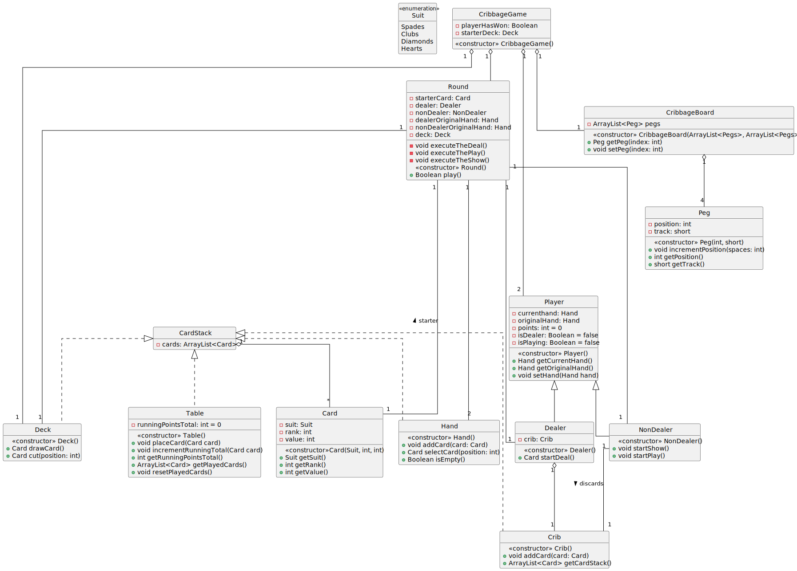

# System Model

## Diagram

## Description

### Suit

Intended to pragmatically represent the Card's suit.

### Card

A generic entity that represents a physical deck card. It's uniqueness is determined by it's rank and suit. Value is necessary for specific rules within the game for cards with a rank greater than 10. Note, after construction, card properties are immutable.

### CardStack

A generic container for a stack of cards.

### Deck

A stacked collection of cards. Consumers can draw a card, causing the card to be removed from the deck. The deck can also be cut, where the top card is returned from the split deck.

### Hand

A stacked collection of cards. Cards can be added to the hand and they can also be selected, which causes them to be removed from the hand.

### Crib

An initially empty stacked collection of cards. Cards are added to the crib, and cannot be removed. Upon completion of the round, the crib is emptyed and cards return to the deck.

### Peg

A generic entity representing a physical peg. It is placed on a cribbage board and it's location is determined by a numeric position and on which track it is traveling. At round end, the locations of the pegs are incremented appropriately.

### CribbageBoard

A generic entity representing the physical cribbage board. Acts functionally as a container for all player pegs. Pegs are modified by their requisite positions.

### Player

Represents an active player within the game. This includes the current and original hand and whether the player is a dealer or is actively playing. The current hand can be modified by consumers.

### Table

Represents a container for running point calculation and all played cards.

### Round

Represents a single gameplay round. Contains the main game loop and dispatches execution of the three main phases of gameplay, the deal, the play, and the show.
